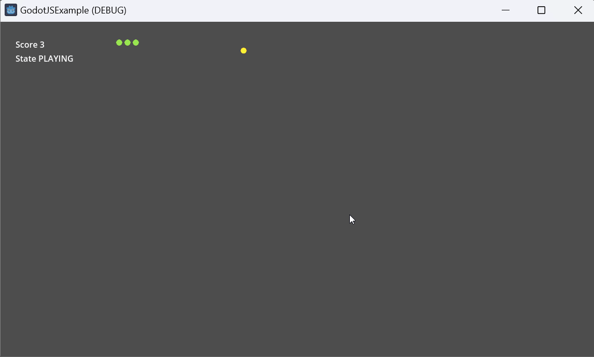
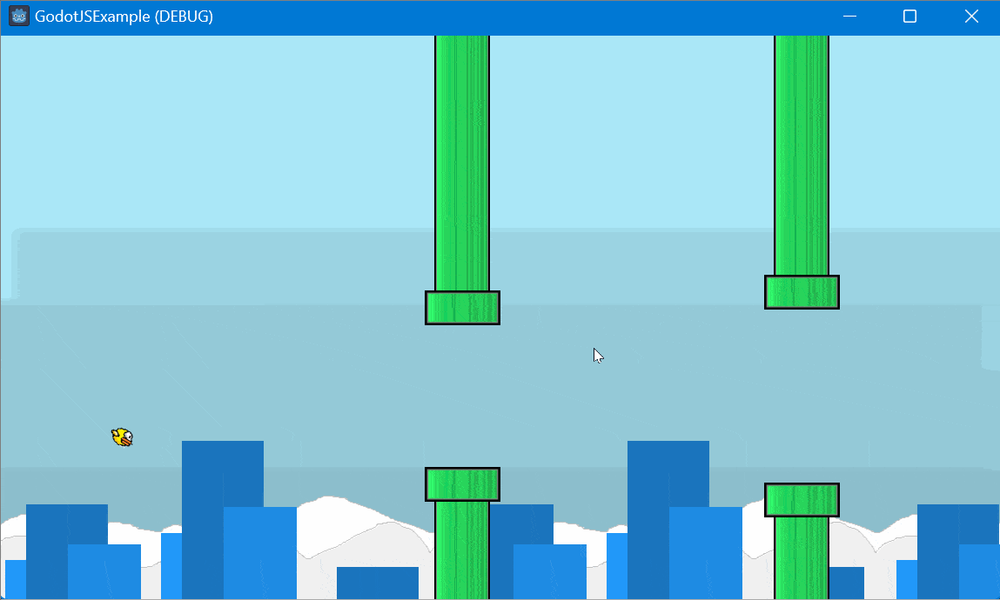
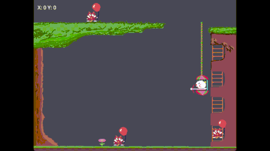

# GodotJSExample
This project includes examples at different complexity levels, incrementally introducing and utilizing more engine features.

A prebuilt version of `Godot Editor` can be downloaded from [GodotJS-Build](https://github.com/ialex32x/GodotJS-Build).

## Snake 
A simple snake game. 
In this example, only a limited subset of Godot's features is utilized: 
* script lifetime callbacks (_ready, _process etc.)
* resource loader
* using primitive types (float, bool, string, StringName)
* export variables

## JumpyBird

Additional features used:
* Signals (connect `area_shape_entered` signal with js class member function)

## Piggy

Additional features used:
* `signal_` annotation
* `onready_` annotation
* `export_` annotation

